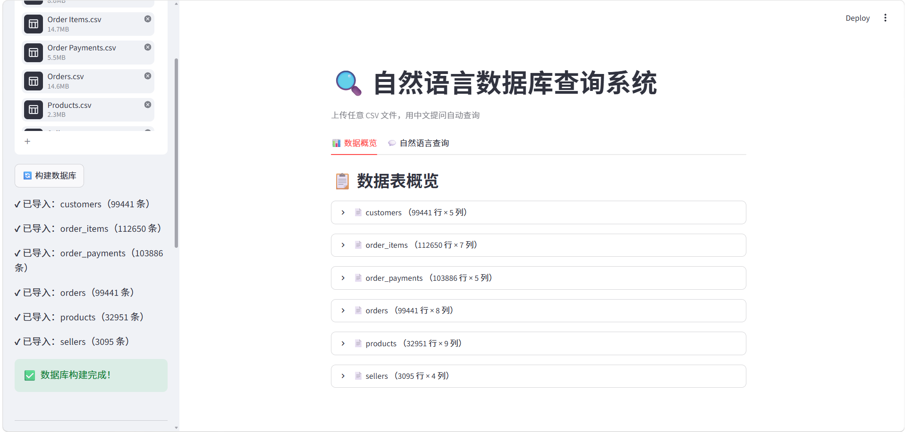
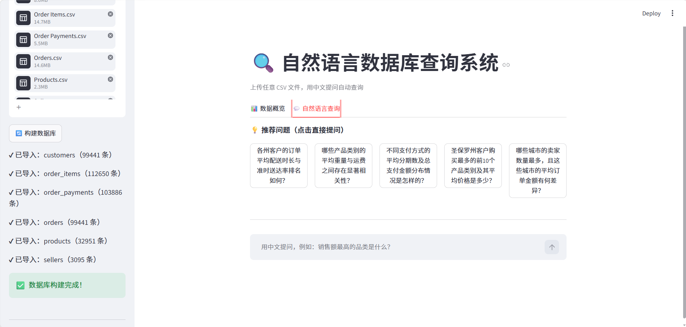
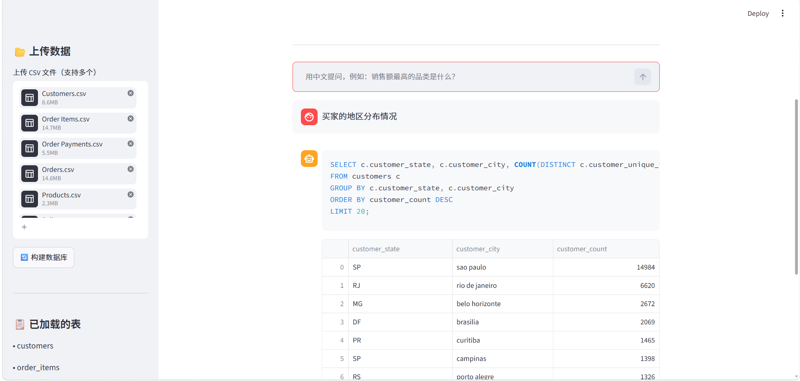
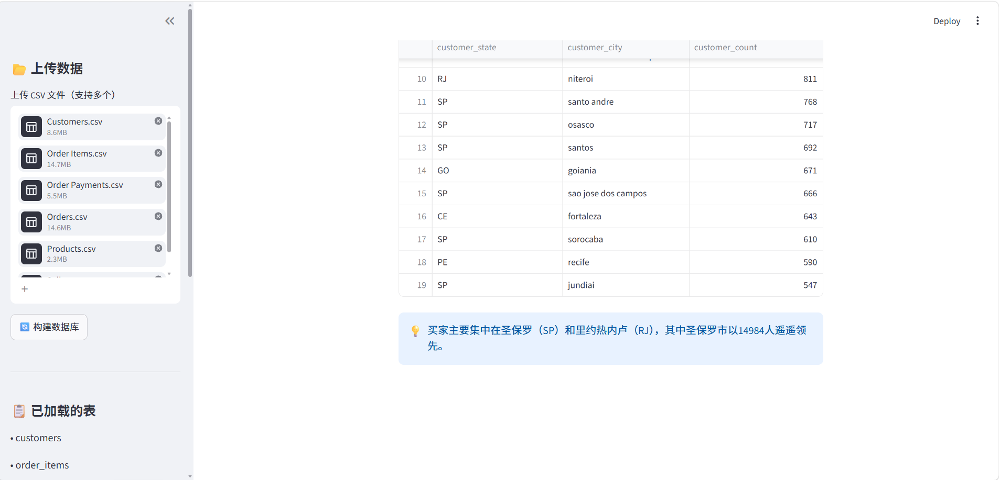
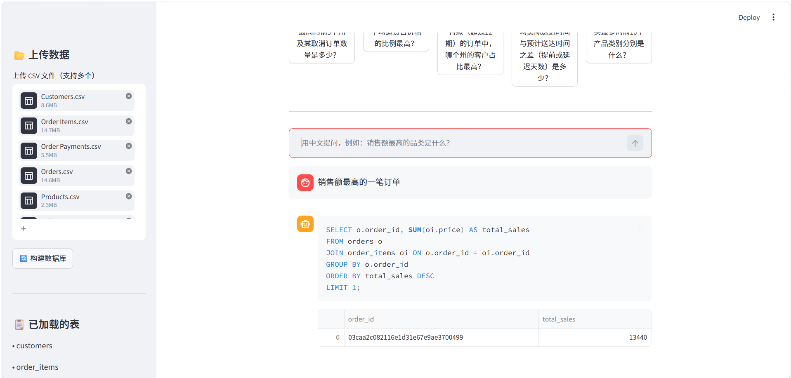
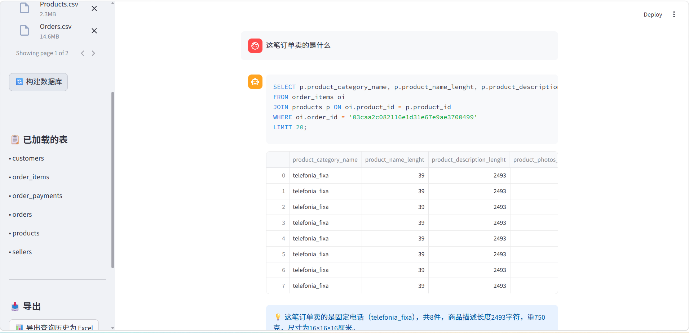
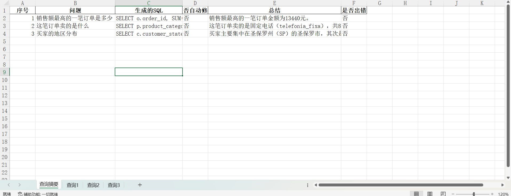

# 🔍 自然语言数据库查询系统（Text-to-SQL）

> 上传任意 CSV 文件，用中文自然语言提问，系统自动生成 SQL 查询数据库并返回结果、图表与总结。

## 项目背景

企业中大量业务人员有数据查询需求，但不具备 SQL 编写能力。本项目基于大语言模型实现 Text-to-SQL 功能，用户只需用自然语言描述需求，系统自动生成并执行 SQL 查询，返回结果表格、可视化图表与自然语言总结，让任何人都能轻松分析数据，无需掌握 SQL 语法。

## 功能特点

- 📂 支持上传任意 CSV 文件，自动构建 SQLite 数据库
- 📊 数据概览页面，自动展示行列数、数据类型、缺失值、数据预览
- 💡 根据数据自动生成推荐问题，一键提问
- 🤖 自然语言转 SQL，自动执行查询
- 🔧 SQL 出错自动修复重试，具备容错机制
- 📈 自动生成饼图、柱状图等可视化图表
- 💬 自然语言总结查询结果
- 📥 查询历史一键导出为 Excel（含摘要和每条查询结果）

## 技术栈

| 模块 | 技术 |
|------|------|
| 大语言模型 | DeepSeek API（兼容 OpenAI 接口）|
| 数据库 | SQLite |
| 数据处理 | Pandas |
| 数据可视化 | Plotly |
| 导出功能 | openpyxl |
| 前端界面 | Streamlit |

## 系统架构与实现原理

```
用户上传 CSV 文件
        ↓
自动解析列名和数据，构建 SQLite 数据库
        ↓
分析表结构，生成 Schema 说明 + 推荐问题
        ↓
用户用自然语言提问
        ↓
DeepSeek 根据 Schema 生成 SQL
        ↓
执行 SQL（出错则自动修复重试）
        ↓
返回结果表格 + 可视化图表 + 自然语言总结
        ↓
支持导出查询历史为 Excel
```

**SQL 自动修复机制**

当生成的 SQL 执行出错时，系统会将错误信息和原始 SQL 一起发送给模型，让模型分析错误原因并重新生成修复后的 SQL，用户无感知，体验上直接返回正确结果。

## 快速开始

### 环境要求

- Python 3.9+
- DeepSeek API Key（[申请地址](https://platform.deepseek.com/)）

### 1. 克隆项目

```bash
git clone https://github.com/shiyut88-create/text-to-sql.git
cd text-to-sql
```

### 2. 安装依赖

```bash
pip install streamlit openai pandas plotly openpyxl
```

### 3. 启动应用

```bash
streamlit run app.py
```

### 4. 使用步骤

1. 在左侧侧边栏上传 CSV 文件（支持多个）
2. 点击「🔄 构建数据库」按钮
3. 在「📊 数据概览」Tab 查看数据结构
4. 在「💬 自然语言查询」Tab 点击推荐问题或自己输入问题
5. 查看结果表格、图表和总结
6. 点击侧边栏「📊 导出查询历史为 Excel」保存结果

## 项目截图

### 1️⃣ 页面概览


### 2️⃣ 上传文件与智能推荐
上传 CSV 文件后，系统自动构建 SQLite 数据库，并根据数据特征生成 5 个推荐问题。





### 3️⃣ 核心功能展示
自然语言提问后，系统自动生成 SQL 并返回结果表格与可视化图表。





### 4️⃣ 支持多轮追问
用户可基于前序查询结果继续追问，无需重复描述上下文。





### 5️⃣ 导出查询历史
一键将查询历史导出为 Excel，包含摘要和每条查询的详细结果。



## 作者

谭诗语 | shiyut88@gmail.com
