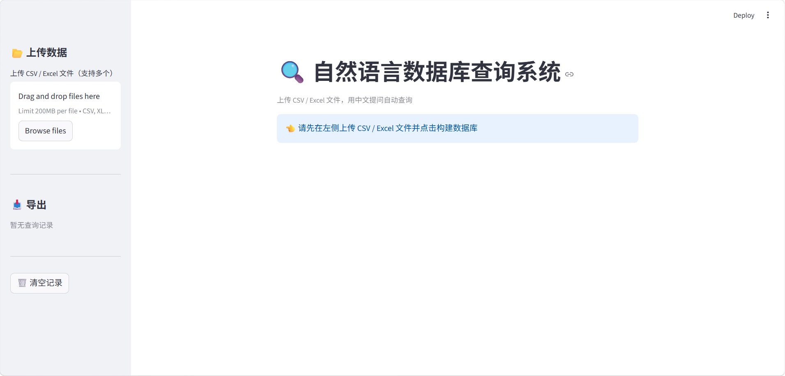
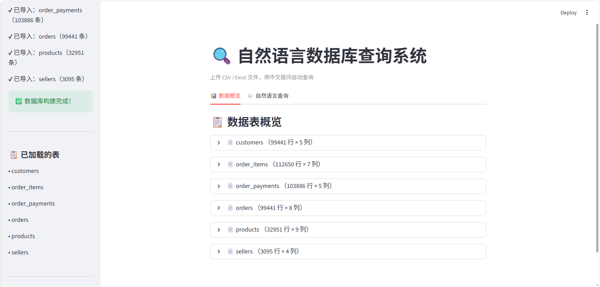
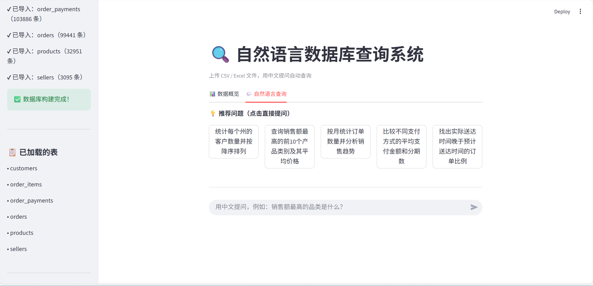
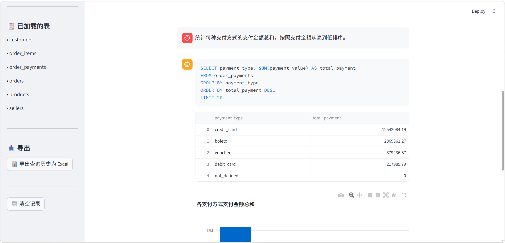
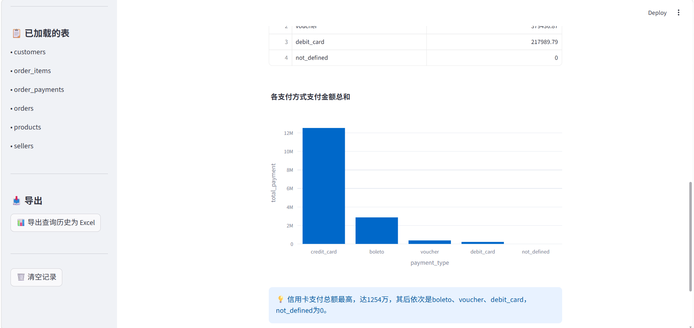
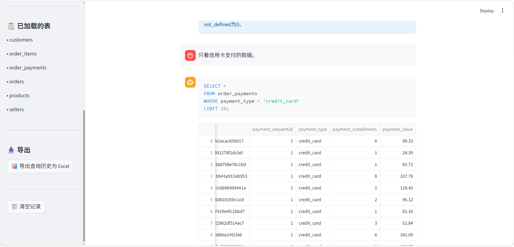
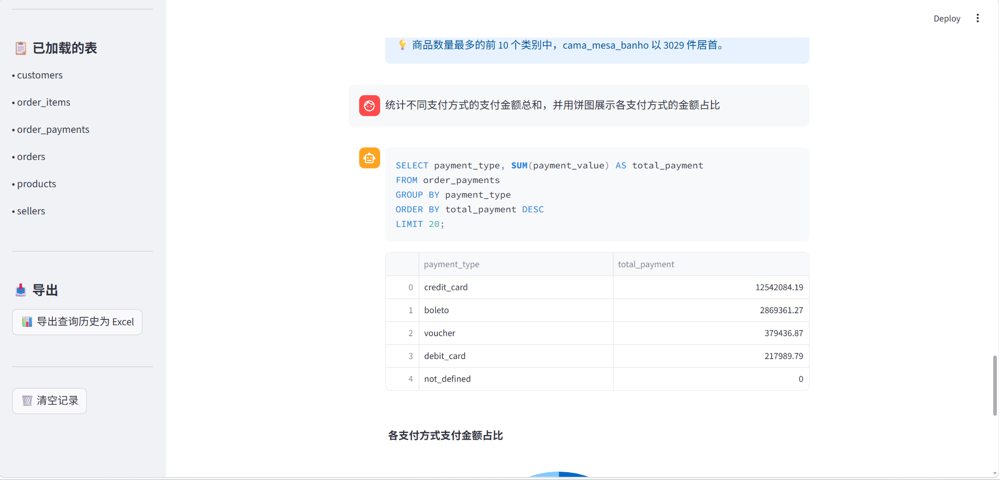
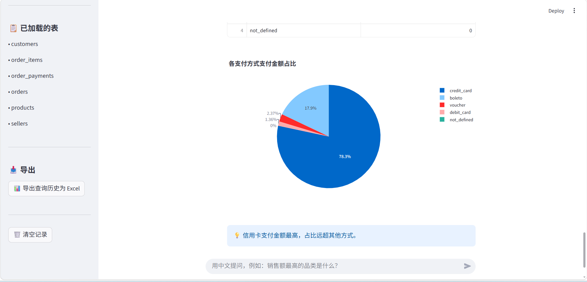
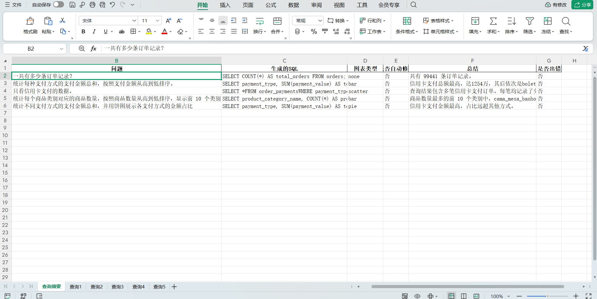

# 🤖 Text-to-SQL 智能数据库查询助手

一个基于 **DeepSeek + Streamlit + SQLite** 开发的自然语言数据库查询应用。

用户上传 CSV 或 Excel 文件后，系统会自动读取数据并构建 SQLite 数据库。通过接入 DeepSeek 大语言模型，用户可以直接使用自然语言提出数据查询需求，系统自动生成并执行 SQL 语句，并以数据表、可视化图表和文字总结的形式展示查询结果。同时，系统支持多轮对话追问和历史记录导出，让数据查询与分析更加简单、高效。

## 📸 项目展示

### 01. 首页展示

系统首页展示应用的主要功能，用户可以上传数据文件并开始自然语言查询。



### 02. 上传文件与构建数据库

支持上传 CSV、Excel 等表格文件。系统读取文件内容并构建 SQLite 数据表，同时展示已加载的数据表及数据概览，方便用户了解当前数据。



### 03. AI 智能推荐问题

系统根据当前数据内容，自动生成推荐问题。用户可以选择感兴趣的问题快速开始分析，降低数据查询的使用门槛。



### 04. 自然语言提问与 SQL 查询

用户可以直接输入自然语言问题，系统调用 DeepSeek 将问题转换为 SQL 查询语句，并执行查询、展示结果。用户无需手动编写复杂的 SQL 代码。



### 05. 智能图表生成与结果总结

系统根据查询结果生成相应的数据可视化图表，并提供自然语言总结，帮助用户直观地理解数据变化和查询结果。



### 06. 多轮对话与连续追问

支持基于前一次查询结果继续提问。用户可以进一步筛选数据、比较指标或深入分析，无需每次重新描述完整的查询需求。



### 07. 数据可视化展示（一）

针对不同的数据查询需求，系统可以展示相应的可视化结果，帮助用户从不同角度观察和分析数据。



### 08. 数据可视化展示（二）

通过不同问题的查询结果，展示系统在数据分析和图表展示方面的应用效果。



### 09. 历史对话导出

支持导出历史查询记录，便于用户保存查询过程、整理分析结果和进行后续查看。



## ✨ 核心功能

- **多类型文件上传**：支持 CSV、Excel 等表格文件。
- **自动构建数据库**：将上传的数据加载到 SQLite 数据库中，方便后续查询。
- **数据概览展示**：展示已加载的数据表及相关信息。
- **AI 智能推荐问题**：根据数据内容推荐可供选择的查询问题。
- **自然语言转 SQL**：利用 DeepSeek 将自然语言问题转换为 SQL 查询语句。
- **SQL 查询执行**：执行生成的查询语句，并以表格形式展示查询结果。
- **智能数据可视化**：根据查询结果生成相应的图表。
- **自然语言结果总结**：对查询结果进行解释和归纳，帮助用户理解数据。
- **多轮对话追问**：支持基于上下文继续提问和分析。
- **历史记录导出**：支持导出历史对话，方便保存和整理。
- **SQL 安全检查**：对生成的 SQL 进行检查，并通过只读执行限制降低误操作风险。

## 🛠️ 技术栈

| 技术 | 用途 |
| --- | --- |
| Python | 应用开发与业务逻辑实现 |
| Streamlit | Web 交互界面开发 |
| DeepSeek API | 自然语言理解与 SQL 生成 |
| SQLite | 数据存储与 SQL 查询执行 |
| Pandas | 表格数据读取与处理 |
| Plotly Express | 数据可视化 |
| OpenPyXL | Excel 文件读写支持 |

## 🚀 运行项目

### 1. 克隆项目

将下面的仓库地址替换为你自己的 GitHub 仓库地址。

```bash
git clone https://github.com/YOUR_USERNAME/text-to-sql.git
cd text-to-sql
```

### 2. 安装依赖

建议使用 Python 虚拟环境。进入项目目录后，执行：

```bash
pip install -r requirements.txt
```

### 3. 配置 DeepSeek API Key

在项目根目录下创建 `.env` 文件，并配置自己的 DeepSeek API Key：

```env
DEEPSEEK_API_KEY=your_deepseek_api_key
```

将 `your_deepseek_api_key` 替换为你自己的 API Key。

**注意：请勿将真实 API Key 上传到 GitHub。** 建议在 `.gitignore` 文件中添加 `.env`，避免将密钥提交到公开仓库。

### 4. 启动应用

在项目根目录下执行：

```bash
streamlit run app.py
```

启动成功后，根据终端提示在浏览器中打开应用地址，即可开始使用。

## 📁 项目结构

```text
text-to-sql/
├── images/
│   ├── 01.png
│   ├── 02.png
│   ├── 03.png
│   ├── 04.png
│   ├── 05.png
│   ├── 06.png
│   ├── 07.png
│   ├── 08.png
│   └── 09.png
├── app.py
├── requirements.txt
├── .gitignore
└── README.md
```

请确保截图文件名与上方路径一致，并将图片放入仓库中的 `images` 文件夹，这样 GitHub 才能正常显示项目截图。

## 💡 项目亮点

本项目将大语言模型与关系型数据库查询相结合，把传统的 SQL 编写过程转化为自然语言交互过程。用户可以通过简单的提问完成数据查询、结果查看、图表分析和多轮追问，降低了数据库查询的使用门槛，也提高了表格数据探索与分析的效率。